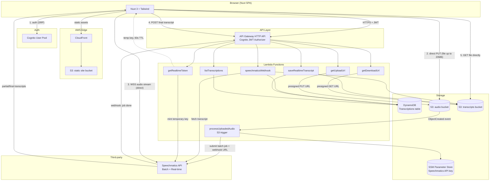
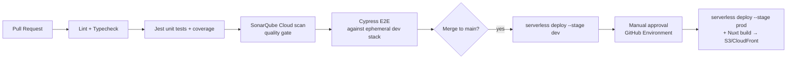

# Voice AI — Audio Transcription Platform
## Technical Architecture Document

**Version:** 1.0
**Date:** 2026-08-14
**Author:** Rodrigo
**Status:** Design — implementation not started

---

## 1. Objective and scope

This document defines the technical architecture for a cloud-based audio transcription service, per the original project brief. The platform lets a registered user:

1. Register an account
2. Authenticate
3. Log out
4. Transcribe an uploaded audio file (up to 20 MB)
5. Transcribe live audio from the computer microphone in real time
6. List their transcription history, paginated at 10 items per page
7. Download any past transcription

The brief mandates: NodeJS + TypeScript backend, an IaC framework (Serverless Framework or Terraform) orchestrating AWS Lambda, DynamoDB, S3, Cognito, and Jest for backend unit tests; a NuxtJS + TypeScript frontend styled with Tailwind CSS or Materialize, tested with Jest and Cypress. This document also adds **SonarQube (SonarQube Cloud)** for static analysis, per the user's requirement, and specifies how the project runs **locally** and how it gets **deployed** to AWS.

Everything below is the *design*. No code is written in this pass — the companion document `IMPLEMENTATION_PLAN.md` breaks the build into ordered, executable steps.

---

## 2. Guiding decisions

| Decision | Choice | Why |
|---|---|---|
| IaC framework | **Serverless Framework v3** (MIT-licensed) | Purpose-built for Lambda-centric apps, minimal boilerplate for API Gateway + Lambda + DynamoDB + S3 + Cognito wiring, mature local-emulation plugin ecosystem (`serverless-offline`). Serverless Framework v4 introduced a commercial license for organizations past a usage threshold; pinning to v3 keeps the whole stack free and open source. Terraform was considered but adds more ceremony for a single-service, Lambda-only backend. |
| API layer | **API Gateway HTTP API** (not REST API) | Cheaper, lower latency, native JWT authorizer that verifies Cognito access tokens without a custom Lambda authorizer. |
| Compute | **AWS Lambda**, one function per use case (fine-grained, least-privilege IAM per function) | Matches the brief's requirement and scales to zero. |
| Database | **DynamoDB**, single table | Matches the brief; single-table design avoids join-like access patterns we don't need. |
| Object storage | **S3**, two buckets (`audio`, `transcripts`) | Matches the brief; separating audio (large, short-lived) from transcripts (small, long-lived) lets us apply different lifecycle rules. |
| Auth | **Cognito User Pool**, frontend talks to Cognito directly for sign-up/sign-in/sign-out | No custom Lambda is needed for the three auth use cases — Cognito already implements them securely (SRP, hashed credentials, email verification, refresh tokens). This also reduces the attack surface: passwords never transit our own Lambdas. |
| Transcription provider | **Speechmatics** (free-tier: $100 starting credit, 56+ languages, 2 concurrent real-time sessions, batch jobs) | Recommended by the brief; offers both a batch (file) API and a real-time WebSocket API, which map directly onto the two transcription use cases. |
| Static analysis | **SonarQube Cloud** (formerly SonarCloud) in CI, optional local **SonarQube Community Edition** container for pre-push scans | Free for this project's scope, first-class GitHub Actions integration (`sonarqube-scan-action`), enforces a quality gate (coverage, duplication, code smells, vulnerabilities) on every PR. |
| Frontend styling | **Tailwind CSS** over Materialize | Better first-class Nuxt 3 module support (`@nuxtjs/tailwindcss`), smaller bundle, easier to keep design consistent with utility classes. |
| Frontend hosting | **S3 + CloudFront** (static/SPA build) | Fully serverless, cheap, matches the "AWS stack" requirement, avoids the extra complexity of SSR-on-Lambda for an app that is entirely behind auth after the landing/login screen. |

---

## 3. High-level architecture



Two things are deliberately **not** proxied through Lambda:

- **Audio upload** — a 20 MB file exceeds API Gateway's 10 MB hard payload ceiling and Lambda's 6 MB synchronous payload ceiling, so the frontend uploads straight to S3 with a presigned URL.
- **Real-time audio streaming** — Lambda has a 15-minute max execution time and API Gateway WebSocket bills per message; a long dictation session is cheaper and simpler if the browser streams audio straight to Speechmatics' real-time WebSocket endpoint using a short-lived, scoped temporary key that our backend mints on request.

---

## 4. Use case → component mapping

### 4.1 Register / Authenticate / Log out

The Nuxt app uses `amazon-cognito-identity-js` (or AWS Amplify Auth) to call Cognito directly:

- **Register** → `Cognito.signUp()` + email verification code confirmation.
- **Authenticate** → `Cognito.initiateAuth()` (SRP flow) → returns ID/access/refresh tokens, stored in memory + `httpOnly`-equivalent secure storage strategy (see §6.3).
- **Log out** → `Cognito.signOut()` (revokes refresh token / global sign-out) and the SPA clears local session state.

No custom backend endpoint is required for these three flows; API Gateway's Cognito JWT authorizer validates the access token on every subsequent call to our own API.

### 4.2 Transcribe an uploaded audio file (≤ 20 MB)

1. `POST /transcriptions/upload-url` (authenticated) → Lambda `getUploadUrl` creates a `transcriptionId`, writes a DynamoDB item with `status = PENDING_UPLOAD`, and returns an S3 **presigned POST** (not PUT) with conditions enforcing `content-length-range` 0–20 MB and `content-type` starting with `audio/`.
2. Browser uploads the file directly to `s3://voice-ai-audio-{stage}/{userId}/{transcriptionId}/{filename}`.
3. S3 `ObjectCreated` event triggers Lambda `processUploadedAudio`, which submits a Speechmatics batch job (`POST /v2/jobs`) referencing the audio and a `notification_config` webhook pointing back at our API Gateway URL. DynamoDB item moves to `PROCESSING`.
4. When Speechmatics finishes, it calls `POST /transcriptions/webhook` → Lambda `speechmaticsWebhook` fetches the finished transcript, stores it as both `.txt` and `.json` in `s3://voice-ai-transcripts-{stage}/...`, and updates the DynamoDB item to `COMPLETED` (or `FAILED` with an error message).
5. The frontend polls `GET /transcriptions/{id}` every few seconds while `status` is not terminal, or simply refreshes the history list.

Webhook is preferred over polling Speechmatics from our side because it's event-driven (no wasted Lambda invocations) and API Gateway already gives us a public HTTPS endpoint. A scheduled fallback (EventBridge rule, every 60s, only for jobs stuck in `PROCESSING` past a timeout) guards against a missed webhook delivery.

### 4.3 Real-time microphone transcription

1. `POST /transcriptions/realtime-token` (authenticated) → Lambda `getRealtimeToken` calls Speechmatics' Management API to mint a short-lived, scoped temporary API key (documented pattern for browser clients) and returns it, together with the regional WebSocket URL.
2. The browser opens a WebSocket directly to Speechmatics (`wss://{region}.rt.speechmatics.com/v2`), streams PCM audio captured via the Web Audio API / `AudioWorklet` from the microphone, and receives `AddPartialTranscript` / `AddTranscript` messages back in real time, rendered live in the UI.
3. On `EndOfTranscript`, the frontend assembles the final transcript text and calls `POST /transcriptions/realtime` → Lambda `saveRealtimeTranscript` stores the transcript text in the transcripts bucket and writes a DynamoDB item (`type = REALTIME`, `status = COMPLETED`) so it appears in history like any other transcription.

This keeps binary audio off our own compute entirely for the real-time path, which is both the AWS-recommended pattern for streaming workloads and the only practical way to stay within Lambda's execution-time limits.

### 4.4 List transcription history (10 per page)

`GET /transcriptions?cursor={opaque}` (authenticated) → Lambda `listTranscriptions` runs a DynamoDB `Query` against partition key `USER#{userId}`, sort key prefix `TRANSCRIPTION#`, `ScanIndexForward: false` (newest first), `Limit: 10`. DynamoDB pagination is cursor-based (`LastEvaluatedKey`), not offset-based; the Lambda base64-encodes that key and returns it as `nextCursor`, which the frontend passes back to fetch the next page of 10. This is the DynamoDB-idiomatic equivalent of "10 items per page" and avoids the cost of scanning/skipping records that true offset pagination would require.

### 4.5 Download a transcription

`GET /transcriptions/{id}/download` (authenticated) → Lambda `getDownloadUrl` verifies the DynamoDB item's `userId` matches the caller's Cognito `sub` claim (ownership check), then returns a short-lived (e.g. 60s) S3 presigned GET URL for the transcript object. The browser downloads directly from S3.

---

## 5. Data model

Single DynamoDB table, on-demand billing mode.

**Table: `voice-ai-transcriptions-{stage}`**

| Attribute | Type | Notes |
|---|---|---|
| `PK` | String | `USER#{userId}` |
| `SK` | String | `TRANSCRIPTION#{createdAtISO}#{transcriptionId}` — sortable by recency |
| `transcriptionId` | String | UUID |
| `userId` | String | Cognito `sub` |
| `type` | String | `FILE` \| `REALTIME` |
| `status` | String | `PENDING_UPLOAD` \| `PROCESSING` \| `COMPLETED` \| `FAILED` |
| `sourceFileName` | String? | original filename (FILE only) |
| `audioS3Key` | String? | set for FILE type |
| `transcriptS3Key` | String? | set once COMPLETED |
| `language` | String? | detected/selected language |
| `durationSeconds` | Number? | audio duration |
| `speechmaticsJobId` | String? | batch job id, for correlation/debugging |
| `errorMessage` | String? | set on FAILED |
| `createdAt` / `updatedAt` | String | ISO-8601 |

The `userId` prefix embedded in the S3 object key (`{userId}/{transcriptionId}/...`) lets the S3-triggered Lambda derive both IDs from the event without a secondary index. No GSI is required for the use cases in scope; one can be added later (e.g. `GSI1: status` to find stuck jobs) without a migration, since DynamoDB GSIs are additive.

---

## 6. AWS services and configuration

### 6.1 Compute — AWS Lambda
Node.js 20.x runtime, one function per handler (`getUploadUrl`, `processUploadedAudio`, `speechmaticsWebhook`, `getRealtimeToken`, `saveRealtimeTranscript`, `listTranscriptions`, `getDownloadUrl`), each with its own least-privilege IAM role generated by Serverless Framework's per-function `iam.role.statements`. Bundled with `esbuild` (via `serverless-esbuild`) for fast cold starts and small packages.

### 6.2 API — API Gateway HTTP API
One HTTP API, Cognito JWT authorizer attached to all routes except the webhook (which is instead protected by validating a shared-secret query parameter/header that we generate and pass to Speechmatics in `notification_config`, since it isn't a user-authenticated call). CORS restricted to the CloudFront domain.

### 6.3 Auth — Cognito
- One User Pool per stage, email as the username alias, mandatory email verification, password policy (min 12 chars, upper/lower/number/symbol), account recovery via verified email.
- One **public** App Client (no client secret — required for SPA/SRP flows), refresh token validity ~30 days, access/ID token validity 1 hour.
- Frontend token storage: access/ID tokens kept in memory + `sessionStorage` fallback for page reloads (never `localStorage` for the refresh token); short token lifetime plus refresh-token rotation limits exposure if XSS were ever to leak storage. Note: browser storage APIs are used only in the real deployed app, not in any Claude-authored HTML artifact.
- API Gateway's built-in JWT authorizer validates the access token's signature, issuer, and audience — no custom authorizer Lambda needed.

### 6.4 Database — DynamoDB
On-demand capacity (no capacity planning needed at this scale), point-in-time recovery enabled, server-side encryption with AWS-owned key (upgradeable to a customer-managed KMS key later).

### 6.5 Storage — S3
- `voice-ai-audio-{stage}`: private, SSE-S3 encryption, CORS allowing `PUT`/`POST` from the CloudFront domain, lifecycle rule expiring objects after 30 days (audio isn't needed once transcribed), versioning off.
- `voice-ai-transcripts-{stage}`: private, SSE-S3 encryption, no expiry (this is the user's history), versioning off.
- `voice-ai-web-{stage}`: static frontend build, private bucket read only via CloudFront Origin Access Control (OAC) — never public.

### 6.6 Secrets — SSM Parameter Store
Speechmatics API key stored as a `SecureString` parameter (`/voice-ai/{stage}/speechmatics-api-key`), read by Lambda at cold start and cached for the container's lifetime. Free, sufficient for this scope; Secrets Manager (with rotation) is a documented upgrade path if the key ever needs automatic rotation.

### 6.7 Observability
CloudWatch Logs for every Lambda (retention 14 days for dev, 90 for prod), CloudWatch Alarms on Lambda error rate and DLQ depth, AWS X-Ray tracing enabled on the API Gateway → Lambda path for latency debugging.

---

## 7. Third-party integration — Speechmatics

| Use case | Speechmatics API | Notes |
|---|---|---|
| File transcription | Batch API (`POST /v2/jobs`, `notification_config` webhook) | Free tier: 1 job/second, $100 starting credit. |
| Real-time transcription | Real-time WebSocket API (`wss://{region}.rt.speechmatics.com/v2`), temporary key minted via Management API | Free tier: 2 concurrent real-time sessions. |

The permanent Speechmatics API key never reaches the browser: it lives only in SSM Parameter Store and is used server-side (a) to submit batch jobs and (b) to mint short-lived, scoped temporary keys for real-time sessions. This is the integration pattern Speechmatics itself documents for browser clients, and it satisfies the brief's "secure use of third-party AI API" evaluation criterion the same way the Cognito design satisfies "secure use of Cognito."

Sources checked while writing this section: [AWS API Gateway payload limits](https://repost.aws/questions/QU9rp0yBOWTOeQy3TiMyBcKg/scaling-problem-api-gateway-and-lambda-payload-limits), [Lambda payload size limits](https://zaccharles.medium.com/deep-dive-lambdas-request-payload-size-limit-2-2-6350c1ae5577), [Speechmatics pricing/free tier](https://www.speechmatics.com/pricing), [Speechmatics real-time product page](https://www.speechmatics.com/product/real-time).

---

## 8. Static analysis — SonarQube

- **CI**: SonarQube Cloud (the current name for SonarCloud) project, analyzed on every push/PR via the `SonarSource/sonarqube-scan-action` GitHub Action (the older `sonarcloud-github-action` is deprecated in favor of this one). Free for this project's scope. A quality gate (coverage ≥ 80%, 0 new bugs/vulnerabilities, duplication < 3%) blocks merge on failure.
- **Local**: an optional `sonarqube` service in `docker-compose.yml` (SonarQube Community Edition) lets the developer run `sonar-scanner` locally before pushing, using the same `sonar-project.properties` config as CI.
- Coverage reports (`lcov.info`) from both backend and frontend Jest runs are fed to Sonar via `sonar.javascript.lcov.reportPaths`.

Source: [SonarQube Cloud TypeScript coverage docs](https://docs.sonarsource.com/sonarqube-cloud/analyzing-source-code/test-coverage/javascript-typescript-test-coverage), [sonarqube-scan-action](https://github.com/SonarSource/sonarqube-scan-action).

---

## 9. Repository layout

```
voice-ai/
├── backend/
│   ├── src/
│   │   ├── handlers/          # one file per Lambda handler
│   │   ├── domain/            # business logic, framework-agnostic
│   │   ├── infra/              # DynamoDB/S3/Speechmatics clients (adapters)
│   │   └── shared/             # types, validation schemas (zod)
│   ├── tests/                  # Jest unit tests, mirrors src/
│   ├── serverless.yml
│   ├── tsconfig.json
│   └── package.json
├── frontend/
│   ├── pages/ components/ composables/ stores/
│   ├── tests/                  # Jest unit tests
│   ├── cypress/                # E2E tests
│   ├── nuxt.config.ts
│   └── package.json
├── docs/
│   ├── ARCHITECTURE.md
│   └── IMPLEMENTATION_PLAN.md
├── docker-compose.yml           # DynamoDB Local, LocalStack (S3), SonarQube (optional)
├── sonar-project.properties
├── .github/workflows/ci.yml
└── package.json                 # npm workspaces root
```

Backend is organized in loose hexagonal layers (`handlers` → `domain` → `infra`) so business logic is unit-testable without mocking AWS SDK calls in every test, and so the Speechmatics client is a swappable adapter (relevant if the free tier is ever exhausted and another provider is substituted).

---

## 10. Local development

The project must run fully on a developer's machine without a real AWS account for day-to-day iteration:

- **Backend**: `serverless-offline` emulates API Gateway + Lambda locally; `serverless-dynamodb` runs DynamoDB Local; **LocalStack** (free tier, Community Edition) emulates S3 for presigned URLs and event triggers. All three are wired together in `docker-compose.yml` plus `serverless.yml`'s `custom.dynamodb`/`custom.s3` local config.
- **Cognito**: no reliable open-source local emulator exists for Cognito's SRP flow, so local development points at a real **dev-stage Cognito User Pool** in AWS (free tier: 50,000 MAUs). This keeps the auth flow 100% faithful to production instead of behind a mock.
- **Speechmatics**: local dev uses the same free-tier account and API key as the deployed dev stage (via `.env`), since there is no local emulator for a third-party transcription API either.
- **Frontend**: `npm run dev` (Nuxt dev server) with `NUXT_PUBLIC_API_BASE` pointed at `http://localhost:3001` (serverless-offline) or the deployed dev API.
- A root `.env.example` (and one per package) documents every required variable: `AWS_REGION`, `COGNITO_USER_POOL_ID`, `COGNITO_CLIENT_ID`, `SPEECHMATICS_API_KEY`, `DYNAMODB_TABLE`, `AUDIO_BUCKET`, `TRANSCRIPTS_BUCKET`.
- A single `npm run dev` at the repo root (via `concurrently` or npm workspaces scripts) starts Docker services, `serverless-offline`, and the Nuxt dev server together.

---

## 11. CI/CD and deployment



- **GitHub Actions** workflow (`.github/workflows/ci.yml`) with jobs for lint, typecheck, unit tests (backend + frontend, run in parallel), SonarQube scan, and Cypress E2E.
- Every PR deploys an ephemeral `pr-{number}` stage (isolated Lambda/DynamoDB/S3/Cognito resources via Serverless Framework stage naming) so Cypress runs against a real, isolated backend rather than mocks; the stage is torn down (`serverless remove`) when the PR closes.
- Merges to `main` auto-deploy to `dev`; promotion to `prod` requires a manual approval gate (GitHub Environments protection rule) before `serverless deploy --stage prod` runs.
- Frontend deploy: `nuxt generate` (static output) synced to the `voice-ai-web-{stage}` S3 bucket, followed by a CloudFront invalidation.
- AWS credentials for CI use a short-lived role via GitHub's OIDC provider (no long-lived access keys stored as repo secrets).

---

## 12. Security summary

- No plaintext secrets in source control; Speechmatics key in SSM SecureString, AWS credentials via OIDC in CI.
- Every Lambda has its own minimal IAM role (e.g., `listTranscriptions` can only `dynamodb:Query`, `getUploadUrl` can only `s3:PutObject` scoped to its own bucket prefix pattern).
- All S3 buckets private; access only via presigned URLs or CloudFront OAC.
- All data encrypted at rest (S3 SSE, DynamoDB default encryption) and in transit (TLS everywhere, enforced by API Gateway/CloudFront).
- Ownership checks on every read (download, list) compare the resource's `userId` against the Cognito `sub` claim in the verified JWT — never trust a client-supplied user id.
- Input validation on every Lambda handler via `zod` schemas (reject malformed bodies before touching AWS SDK calls).
- Rate limiting via API Gateway usage plans / throttling to protect the Speechmatics free-tier quota from abuse.

---

## 13. Open questions / assumptions to confirm before or during implementation

- Assuming a single AWS account with stage-suffixed resource names (`dev`/`prod`) is acceptable for this exercise, rather than fully separate accounts.
- Assuming GitHub (not GitLab/Bitbucket) for source control and CI, since SonarQube Cloud and the Actions workflow above are written against GitHub Actions.
- Assuming the 7-day submission window means a working, reviewable prototype rather than a production-hardened system — the plan in `IMPLEMENTATION_PLAN.md` is scoped accordingly, with clearly marked stretch items.
